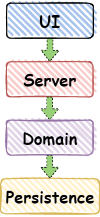
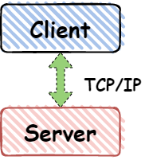
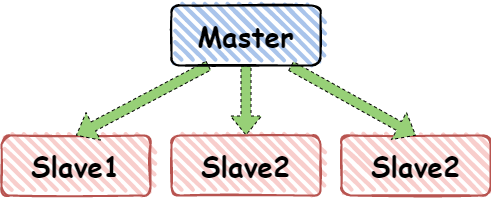
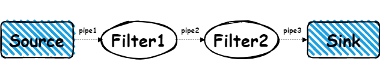
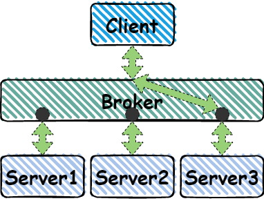
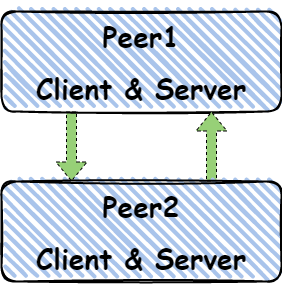
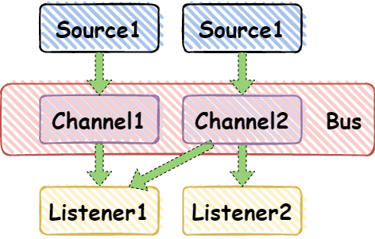
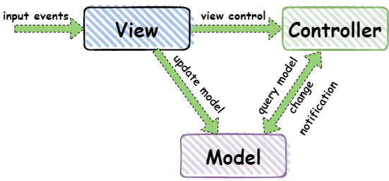

# 常用的十种软件架构模式

 架构模式是在软件架构上针对特定上下文件解决常见问题的通用、可复用的解决方案。架构模式与软件设计模式相似，但范围更广。  

在本文中，我将简要解释以下10种常见的体架构模式及其用法和优缺点。

## 分层模式

此模式可用于构造可分解为子任务组的程序，每个子任务组处于特定的抽象级别。每一层都为下一层提供服务。
信息系统中常见的四层模式如下：

-   表示层（也称为UI层）
-   应用层（也称服务层）
-   业务逻辑层（也称领域层）
-   数据访问层（也称持久化层）

用途： 通用桌面应用 、 电子商务应用 。

## 客户端服务器模式

客户端服务器模式 由两部分组成;一个服务器和多个客户端。服务器组件将为多个客户端组件提供服务。客户端向服务器请求服务，服务器向这些客户端提供相关服务。此外，服务器继续侦听客户机请求。 

用途：在线应用程序，如电子邮件，文档共享和银行应用。

## 主从模式

 这个模式由两部分组成；master和slaves。master组件将工作分配给相同的slave组件，并根据slave组件返回的结果计算最终结果。 

用途：

-   在数据库复制中，将主数据库视为中心负责写数据，从数据库与主数据库同步。
-   连接到计算机系统总线上的外设(主驱动器和从驱动器)。

## 管道过滤器模式

 此模式可用于创建流数据处理系统。每个处理步骤都包含在一个过滤器组件中。要处理的数据通过管道传递。这些管道可用于缓冲或同步目的。 

用途：

-   编译器。连续的过滤器分别执行：词法分析、解析、语义分析和代码生成。
-   信息处理工作流

## 代理模式

此模式结合解耦组件构造分布式系统。这些组件可以通过远程服务调用，相互交互。代理组件负责协调组件之间的通信。
服务器将其功能(服务和特征)发布到代理。客户端向代理请求服务，然后代理根据注册中心将客户端请求重定向到合适的服务。

用途：消息代理软件，如Apache ActiveMQ、Apache Kafka、RabbitMQ、JBoss Messaging。

## P2P模式

 在此模式中，单个组件称为对等组件peer。对等组件既可以作为客户端向其他对等组建请求服务，也可以作为服务器向其他对等组件提供服务。对等组建可以充当客户端或服务器，也可以同时充当两者，它可以随时间动态地更改其角色。 

用途：

-   文件共享网络比如Gnutella和G2
-   基于加密货币的产品，如比特币和区块链

## 事件总线模式

 该模式主要处理事件，有4个主要组件;事件源、事件监听器、通道和事件总线。事件源将消息发布到事件总线上的特定通道。侦听器订阅特定的通道。当消息发布到它们订阅过的通道时，侦听器会得到通知。 

用途：

-   安卓开发
-   通知服务

## MVC 模式（model-view-controller）

这种模式，将交互式应用程序分为3个部分：

-   模型-包含核心功能和数据
-   将信息显示给用户(可以定义多个视图)
-   处理来自用户的输入

这样做是为了将信息的内部表示与信息呈现给用户和从用户接受信息的方式分离开来。它解耦了组件，并允许高效的代码重用。

用途：大部分编程语言都使用的web开发架构；Web框架，如Django和Rails。

## 黑板模式

这种模式在没有确定性解决策略的问题方面很有用。黑板模式由3个主要部分组成。

-   黑板-结构化的全局内存包含解决方案对象

-   知识源-具有自己表示形式的专用模块

-   控制组件-选择、配置和执行模块。

所有的组件都可以访问黑板。组件可以生成添加到黑板上的新数据对象。组件在黑板上寻找特定类型的数据，并通过与现有的知识源进行模式匹配来找到这些数据。

用途：

-   语音识别
-   车辆识别与跟踪
-   蛋白质结构识别
-   声纳信号解析

## 解释器模式

此模式用于设计组件，该组件用于解释专用语言编写的程序。它主要规定了如何对程序行求值，这些程序被称为用特定语言编写的句子或表达式。其基本思想是为语言的每个符号都建立一个类。

用途：

-   数据库查询语言，如SQL。
-   用于描述通信协议的语言。